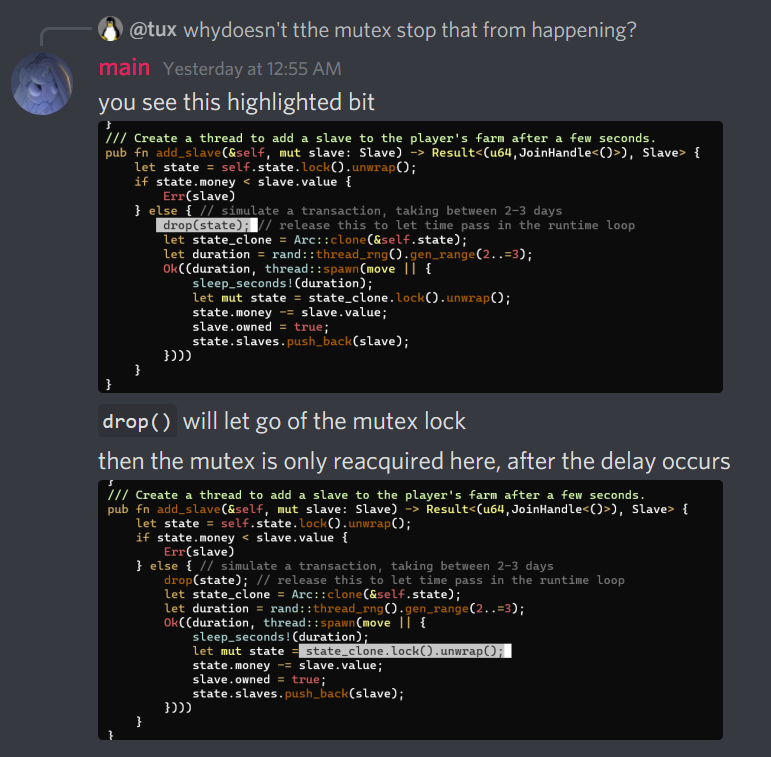
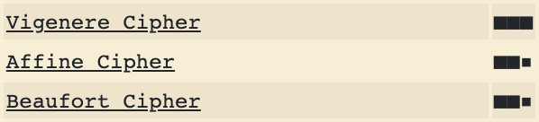
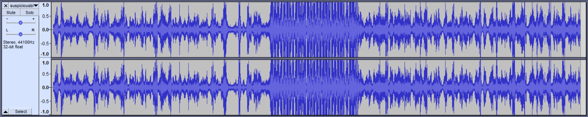
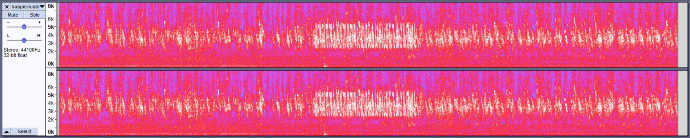
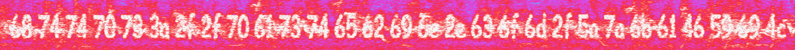
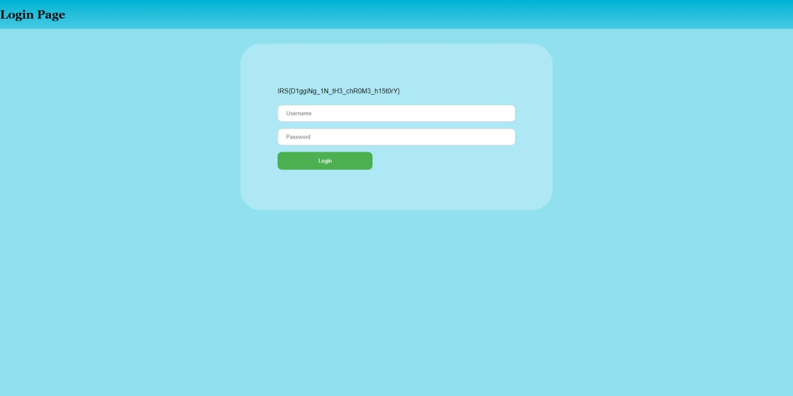
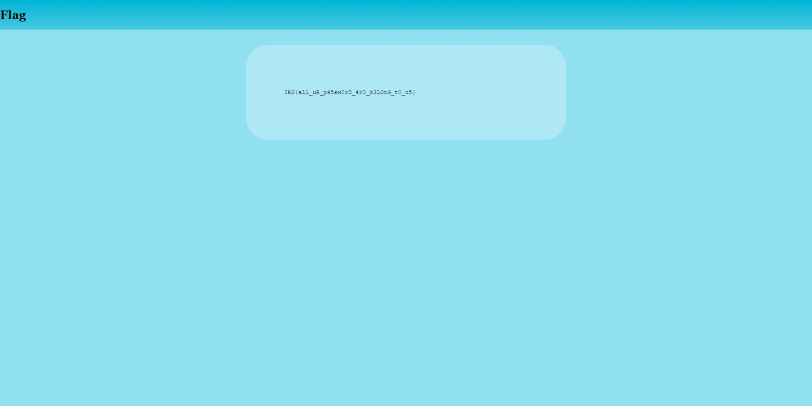

# Sieberrsec CTF 3.0 Writeup

By *spareus* comprising Liu Jie Xu ([@8061xjl](https://github.com/8061xjl)) and Liu Weichu ([@dabby9734](https://github.com/dabby9734))

**🚧 WRITEUPS ARE INCOMPLETE AND STILL WORK IN PROGRESS 🚧**

Archive of CTF challenges can be found [here](https://github.com/8061xjl/ctfarchive-sctf-3.0).

*Writeups are limited.*

---

[PWN](#pwn)

- [ ] [simple](#simple)
- [ ] [warmup](#warmup)
- [ ] [malloc](#malloc)
- [x] [rock farm simulator 2011](#rock-farm-simulator-2011)
- [ ] [Turbo Fast Crypto, part 2](#turbo-fast-crypto-part-2)

[CRYPTO](#crypto)

- [x] [Shalom Shalom](#shalom-shalom)
- [ ] [Turbo Fast Crypto, part 1](#turbo-fast-crypto-part-1)
- [ ] [I can't open this file? Part 2](#i-cant-open-this-file-part-2)
- [ ] [Diffie's Key Exchange](#diffies-key-exchange)
- [ ] [I can't open this file? Part 1](#i-cant-open-this-file-part-1)
- [ ] [totallyfoolproofcrypto](#totallyfoolproofcrypto)
- [ ] [Diffie's Key Exchange 2](#diffies-key-exchange-2)
- [ ] [whodunnit](#whodunnit)

[RE](#re)

- [ ] [Flag checker](#flag-checker)
- [ ] [Reverse](#reverse)
- [ ] [Flag checker v2.0](#flag-checker-v20)

[OSINT](#osint)

- [ ] ["The Sieberr" Heist Part 1](#the-sieberr-heist-part-1)
- [ ] [A Wealth of Information Part 1](#a-wealth-of-information-part-1)
- [ ] [We go way back](#we-go-way-back)
- [ ] [A Wealth of Information Part 2](#a-wealth-of-information-part-2)
- [ ] ["The Sieberr" Heist Part 3](#the-sieberr-heist-part-3)
- [ ] ["The Sieberr" Heist Part 2](#the-sieberr-heist-part-2)
- [ ] [Public Transport Hunt](#public-transport-hunt)

[WEB](#web)

- [ ] [[Part 1] FUTURE TECHNOLOGIES AI IOT FOURTH INDUSTRIAL REVOLUTION SECURITY CAMERA](#part-1-future-technologies-ai-iot-fourth-industrial-revolution-security-camera)
- [ ] [[Part 2] FUTURE TECHNOLOGIES AI IOT FOURTH INDUSTRIAL REVOLUTION SECURITY CAMERA](#part-2-future-technologies-ai-iot-fourth-industrial-revolution-security-camera)
- [ ] [TaiYang IT Solution Part 1](#taiyang-it-solution-part-1)
- [ ] [Exploring The Universe! (Part 1)](#exploring-the-universe-part-1)
- [ ] [TaiYang IT Solution Part 2: Electric Boogaloo](#taiyang-it-solution-part-2-electric-boogaloo)

[FORENSICS](#forensics)

- [x] [Duck Delivery](#duck-delivery)
- [x] [Birds?](#birds)
- [x] [Digging In The Dump Pt. I](#digging-in-the-dump-pt-i)
- [x] [Digging In The Dump Pt. II](#digging-in-the-dump-pt-ii)
- [ ] [Mind Cracking Adversity](#mind-cracking-adversity)
- [ ] [Exploring The Universe! (Part 2)](#exploring-the-universe-part-2)
- [ ] [plush, lush, flush, blush](#plush-lush-flush-blush)

[MISC](#misc)

- [ ] [Heads and Tails Part 1](#heads-and-tails-part-1)
- [ ] [Heads and Tails Part 2](#heads-and-tails-part-2)
- [ ] [Heads and Tails Part 3](#heads-and-tails-part-3)
- [ ] [Can You Math It?](#can-you-math-it)
- [ ] [I lost my anime collection! Pt. II](#i-lost-my-anime-collection-pt-ii)
- [ ] [I lost my anime collection! Pt. I](#i-lost-my-anime-collection-pt-i)
- [ ] [rock farming simulator deluxe edition](#rock-farming-simulator-deluxe-edition)

[SANITY](#sanity)

- [ ] [sanity check](#sanity-check)

---

## PWN

### rock farm simulator 2011

[Challenge](https://github.com/8061xjl/ctfarchive-sctf-3.0#rock-farm-simulator-2011)

*We did not solve this challenge during the competition.*

Summary of how this works:



*This is not a complete writeup, just an extension of what I had to do to get it to work.*

Working examples from challenge author *main*:

https://user-images.githubusercontent.com/44281062/147614438-253b789f-aea1-470b-9e2a-df09a5fa129c.mov

[](https://asciinema.org/a/MQ9MRRVn1jxJO3SeBCRJTU8rj)

The solution is to quickly buy 2 ponies during the delay. However, it was incredibly difficult for me to get that to work (perhaps I'm just too slow lol), so I wrote a small [AHK](https://www.autohotkey.com/) script to send the keys I need, hoping it would be faster:

```
#NoEnv  ; Recommended for performance and compatibility with future AutoHotkey releases.
; #Warn  ; Enable warnings to assist with detecting common errors.
SendMode Input  ; Recommended for new scripts due to its superior speed and reliability.
SetWorkingDir %A_ScriptDir%  ; Ensures a consistent starting directory.

KeyWait, LAlt, D
KeyWait, LAlt, L
Send b
Send t
Send b
Send b
Send p
Send h
Send h
```

It worked. scripts > humans

## CRYPTO

### Shalom Shalom

[Challenge](https://github.com/8061xjl/ctfarchive-sctf-3.0#shalom-shalom)

This challenge provided us with a string to decrypt (`xibkgltizksbrhxllo`). The words **AT** and **BASH** were capitalised in the challenge description, indicating a clue.

*Intended solution was to decipher the string with the [Atbash](https://en.wikipedia.org/wiki/Atbash) cipher that the clues were referring to. By [deciphering](https://www.dcode.fr/atbash-cipher) it, we get the flag `cryptographyiscool`*

We ran the string through a [cipher identifier](https://www.dcode.fr/cipher-identifier) to find out what cipher was used.



We get the flag by deciphering the string with [Affine Cipher](https://www.dcode.fr/affine-cipher) in bruteforce mode. It is interesting to note that the Atbash cipher is just an Affine cipher with a fixed key 🙂.

## FORENSICS

### Duck Delivery

[Challenge](https://github.com/8061xjl/ctfarchive-sctf-3.0#duck-delivery)

Notice that the file is rather large (around 12 mb) while the image itself is small. Playing around with the image (and deducible from the hint), we can extract the zip file embedded in the image using [binwalk](https://github.com/ReFirmLabs/binwalk). The flag appears for a short while in the gif.

### Birds?

[Challenge](https://github.com/8061xjl/ctfarchive-sctf-3.0#birds)

From experiences with other CTFs (also mentioned in the hint), we put the audio file into [Audacity](https://www.audacityteam.org/) (other common software used for this purpose include [Sonic Visualiser](https://www.sonicvisualiser.org/)) and notice a very odd section near the middle when viewing the waveform:



Looking at the spectrogram, we can see some text in that region.





Zooming in, we get some hex: `68 74 74 70 73 3a 2f 2f 70 61 73 74 65 62 69 6e 2e 63 6f 6d 2f 5a 7a 6b 61 46 59 69 4c`, which when decoded gives us a [pastebin](https://pastebin.com/ZzkaFYiL) containing the flag.

### Digging In The Dump Pt. I

[Challenge](https://github.com/8061xjl/ctfarchive-sctf-3.0#digging-in-the-dump-pt-i)

Using [DB4S](https://sqlitebrowser.org/) (or some [online SQLite viewer](https://inloop.github.io/sqlite-viewer/)), we can take a look at Alex's Chrome history (stored in the SQLite database `AppData/Local/Google/Chrome/User Data/Default/History`). In the `urls` table, we see the last two URLs leads us to [http://challs.sieberrsec.tech:23547/dcfa237943d4fd7e2a514ca54642efaccd2cdbd5003bfb19a1e70737273e1190/](http://challs.sieberrsec.tech:23547/dcfa237943d4fd7e2a514ca54642efaccd2cdbd5003bfb19a1e70737273e1190/) where the flag is displayed:



### Digging In The Dump Pt. II

[Challenge](https://github.com/8061xjl/ctfarchive-sctf-3.0#digging-in-the-dump-pt-ii)

We can easily get the username from the saved logins (stored in the `logins` table in the SQLite database `AppData/Local/Google/Chrome/User Data/Default/Login Data`), but the password is slightly more difficult to get since it is encrypted.

*Intended solution using [ChromePass](https://www.nirsoft.net/utils/chromepass.html) is less tedious than what we did. There was also a unintended solution by a participant who found the flag in cached in Chrome (there's an [useful tool](https://www.nirsoft.net/utils/chrome_cache_view.html) for that as well).*

We found a [script](https://github.com/agentzex/chrome_v80_password_grabber/blob/master/chrome_v80_password_grabber.py), but it uses the local machine's DPAPI functions, which we do not want. Therefore, we exported the "master_key" before the CryptUnprotectData function was called.

Using [Mimikatz](https://github.com/gentilkiwi/mimikatz), we extracted the DPAPI master key with the user password given to us following [this guide](https://book.hacktricks.xyz/windows/windows-local-privilege-escalation/dpapi-extracting-passwords#extract-a-master-key) (`dpapi::masterkey /in:"AppData\Roaming\Microsoft\Protect\S-1-5-21-1937579505-2679969469-2152769792-1001\37b49573-c2de-487a-81be-b8c2f9b4df15" /password:Password1 /protected`). We can then use this masterkey to decrypt the exported master_key from the script (`dpapi::blob /in:masterkey /unprotect`, specifying the /masterkey: is unnecessary since Mimikatz keeps the DPAPI keys cached in the same session).

After decrypting the master_key blob, we can put it back into the script and run it to extract the password.

Getting the username (`Alex24`) and password (`IHeartCookies`), we log into the website from the previous part of this challenge series, and we get the flag:


