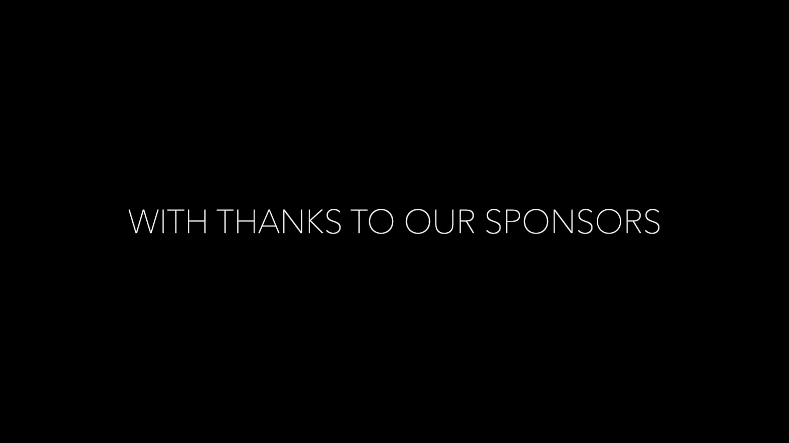
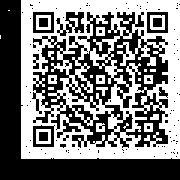

# SEETF 2022 Writeup

Only some challenges are available in this writeup, for the purpose of submission.

---

[Misc](#misc)

- [Welcome](#welcome)

---

## Misc

### Welcome

Author: zeyu2001

#### Description

> Welcome to SEETF! Submit the teaser video flag here.
>
> [https://www.youtube.com/watch?v=0GVC30jiwJs](https://www.youtube.com/watch?v=0GVC30jiwJs)
>
> Download: [https://drive.google.com/file/d/1Dlfp6vC1pto7vW5WUKqvX-tbIt6tfGfg/view](https://drive.google.com/file/d/1Dlfp6vC1pto7vW5WUKqvX-tbIt6tfGfg/view)
>
> MD5: `8356ab36b1bd286a514dfdca483207e8`

While watching the wonderful trailer, we notice that starting from 00:00:26, there are some weird blinking white pixels near the top-right corner.

  
*Observe the top-right corner, there are some blinking pixels in seemingly random positions.*

To make running and debugging any processing code faster and easier, we can crop the video to only keep the top-right corner and also remove the front part of the video using [FFmpeg](https://ffmpeg.org/):

`ffmpeg -ss 00:00:26 -i Trailer_With_Challenge_crop.mp4 -filter:v "crop=180:180:1740:0" processed.mp4`

`-ss 00:00:26`: input seeking to start from 00:00:26  
`-i Trailer_With_Challenge_crop.mp4`: input file  
`-filter:v "crop=180:180:1740:0"`: crop the video to only keep the top-right corner, `180:180:1740:0` being `w:h:x:y`, with `w` and `h` being the width and height of the cropped video, and `x` and `y` being the x and y coordinates in the original video to be used as the top-left corner of the output video.

We then try to combine all the pixels together, to see if it produces any useful information. To do so, I decided to use [OpenCV](https://opencv.org/) as I was decently familiar with the library.

```python
import cv2 as cv
import numpy as np

# Create a blank image of the same size as the input video
output = np.zeros((180, 180), np.uint8)

cap = cv.VideoCapture("Trailer_with_challenge_crop_trim.mp4")  # Open the video file
while cap.isOpened():  # Loop until the video is over
    # Read the next frame into frame, ret will be `false` if no frame is read
    ret, frame = cap.read()

    # Break if there are no more frames to read
    if not ret:
        break

    # Filter the white (BGR above (200, 200, 200)) pixels from the frame
    mask = cv.inRange(frame, (200, 200, 200), (255, 255, 255))
    # and put them in the output image, using or to combine the different frames
    output = np.bitwise_or(output, mask)

cv.imwrite("output.png", output)  # Save the output image

cap.release()  # Close the video file (er actually unnecessary but i think good habit)
```

The script above will generate a `output.png` file, which contains all white pixels (those with BGR values all above 200) as pure white pixels. This combines all the blinking white pixels, producing a scannable QR code.



Scanning the QR code gives us the flag (`SEE{W3lc0m3_t0_SEETF_95c42d3be1cb93cce8241235529ad96f8e0e1c12}`). However, the QR code is not very *aesthetically pleasing*... With the knowledge that the pixles produce a QR code, we can actually improve our code to recover a perfect(?) QR code.

We notice that in every frame, the white pixels actually come as a square of 3x3 pixels. This corresponds to one square in the QR code grid. Therefore, we can resize every frame from 180x180 pixels to 60x60 pixels, taking the average of a 3x3 square of pixels to produce every pixel in the new frame.

This can be done with [`cv.resize()`](https://docs.opencv.org/4.x/da/d54/group__imgproc__transform.html#ga47a974309e9102f5f08231edc7e7529d).

```python
import cv2 as cv
import numpy as np

# Create a blank image of the same size as the input video
output = np.zeros((60, 60), np.uint8)

cap = cv.VideoCapture("Trailer_with_challenge_crop_trim.mp4")  # Open the video file
while cap.isOpened():  # Loop until the video is over
    # Read the next frame into frame, ret will be `false` if no frame is read
    ret, frame = cap.read()

    # Break if there are no more frames to read
    if not ret:
        break

    # Resize the frame with `interpolation=cv.INTER_AREA` to get a frame
    # with each pixel representing a square in the QR code grid
    resized = cv.resize(frame, (60, 60), interpolation=cv.INTER_AREA)
    # then filter the white (BGR above (200, 200, 200)) pixels from the resized frame
    mask = cv.inRange(resized, (200, 200, 200), (255, 255, 255))
    # and put them in the output image, using or to combine the different frames
    output = np.bitwise_or(output, mask)

cv.imwrite("output.png", output)  # Save the output image

cap.release()  # Close the video file (er actually unnecessary but i think good habit)
```

Modifying the script slightly to work with a shrunk frame, we can get a perfect QR code (open image by itself if it's too small, since it's only 60x60 pixels).

  
*ta-da*
